# DNV GL Machine Learning – Predict external corrosion on oil and gas pipelines

Microsoft sat down with DNV GL in their headquarters to execute on a five-day-hackathon where the focus was to predict external corrosion on pipelines using Machine Learning.

## Customer profile

DNV GL is an international certification body and classification society with main expertise in technical assessment, advisory, and risk management. It was created in 2013 because of a merger between two leading organizations in the field - Det Norske Veritas (Norway) and Germanischer Lloyd (Germany).

DNV GL is the world's largest classification society with 13,175 vessels and mobile offshore units (MOUs), which represents a global market share of 21%. The organization is also a reference in renewable, alternative and conventional energy. It is the world's largest technical consultancy to onshore and offshore wind, wave, tidal, and solar industries, as well as the global oil & gas industry – 65% of the world’s offshore pipelines are designed and installed to DNV GL’s technical standards. Microsoft worked with DNV GL in the Norwegian headquarters in Høvik from the Oil & Gas silo. 

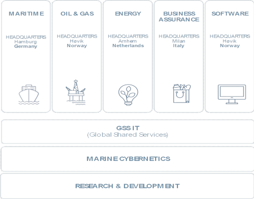

Read more about DNV GL at [Wikipedia](https://en.wikipedia.org/wiki/DNV_GL).

## Challenger story

Since the inception of the federal regulations in the US governing pipeline integrity and safety in the early 2000’s following several high-profile incidents, there has continued to be an unacceptable number of pipeline failures with major impacts on people, property, and the environment.

Since the inception of the regulations governing pipeline safety and integrity in the US is the early 2000’s there has continued to be a succession of high-profile failures. These failures are due not only to a combination of failure to adhere to recommended practices but also a failure of the methodologies and technologies currently recommended and implemented by most pipeline operators. In this period data-driven analytics and machine learning capabilities have come of age and are now practical technologies to be used in routine day to day operations (you and I use them every day, all day long!). Although, used to some level by high technology in pipe inspection companies the technology has not previously been used in practice by operations or considered appropriately by the standards and recommended practices bodies to advance the science of pipeline engineering.

DNV GL as renown experts in pipeline condition assessment realize the weaknesses of today and the strengths of the technology we now have on offer to us and have combined this to provide a software tool that harnesses deep learning analytics alongside engineering know-how and expertise in pipeline degradation expertise.

## Assessment

Assessment is made of a various combination of “appropriate” indirect inspections, the selection of which can be difficult and fragmented over long sections of the pipeline. From this, along with pipeline history, areas are prioritized for physical examination (direct assessment) and the state of the pipeline is determined based upon the corrosion observed in the pipeline at the locations of these excavations.

Inline Inspection Tool (ILI) pigging in the context of pipelines refers to the practice of using devices known as "pigs" to perform various maintenance operations. This is done without stopping the flow of the product in the pipeline. The reason the machines are called a “pig” is because it squeak’s when it goes through the pipes. It collects data through the use of magnetic flux leakage (MFL) and ultrasonic to inspect the pipeline. It uses electromagnetics to sense wall integrity which is transformed from waves to binary digits (digital signals).

### Image of an ILI Pig tool

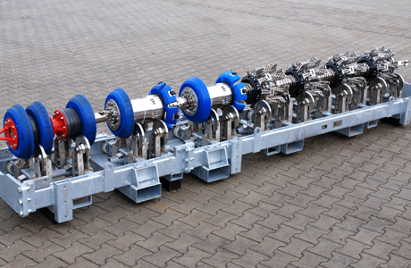

### Heat map showing defects in pipe

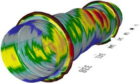

### Anatomy of the ILI Pig tool

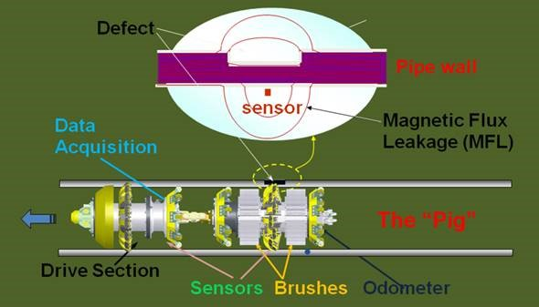

## The objective

The objective is to produce a solution demonstrator that DNV GL can show to customers and also to their own internal groups to promote the technology and raise awareness of the role that analytics brings to their business and the solutions DNV GL delivers. The application is very much one which will have strong appeal in the market and the hackfest will simply be the beginning of something which will become a successful project/demonstrator that DNV GL can build upon and take to the next level.

DNV GL already has an internal tool that visualizes the pipelines around the world. The application is called “Synergi Pipeline” and is connected to a single database that consists of data from multiple data sources gathered/generated from partners and vendors. The web tool allows the users of Synergi Pipeline to do risk and analytical modeling, risk and activity management as well as doing inspection based on the overview. We decided to aim for implementation in Synergi Pipeline of the machine learning predictions based on the model leveraged through a web service in Microsoft Azure.

## The team

Company  | Name | Role
------------- | ------------- | -------------
DNV GL | Bran Eichelberger | Business sponsor
DNV GL | Tom Gilmour | Business sponsor
DNV GL | Jeff Lanchey | BA collaborator
DNV GL | Troy Weyant | Consulting collaborator
DNV GL | Marek Wasilewski | Architect
DNV GL | Jens Eftang | Developer
DNV GL | Lars Peder Amlie | Developer
Microsoft | Justin Bronder | Principal SDE
Microsoft | Olav Tollefsen | Principal Technical Evangelist
Microsoft | Anders Gill | Technical Evangelist


## Tools used during the hackfest:

* Microsoft Azure
 * Storage Blobs
 * Azure ML Studio
 * Azure Notebooks (Jupyter/IPython Notebook)
* Azure Storage Explorer
* Microsoft Excel
* Visual Studio 2017 RC
* FME Desktop 2016

## The process

The project lasted for a period of five days (Monday to Friday), with a presentation of the results in the morning of day five. This meant that the team had four full days to complete the task of;

1.	Understanding the data
2.	Cleaning the data
3.	Building the model
4.	Evaluating the model
5.	Optimizing the model
6.	Creating a web service
7.	Integrating the model

## Understanding the data

Step 1 (understanding the data) meant discussing each and every column that came from the data source (Spatial GIS DB). This requires domain knowledge and we were lucky that we had highly skilled DNV GL representatives on sight to explain what each and every column meant and how it would relate to the big picture.
On Monday, we set the goals for the whole hackfest. 

We created the appropriate Azure accounts, created a resource group, a storage account, an AML (Azure Machine Learning) Workspace and distributed access. We downloaded the necessary tools and created directories for each day in the storage blob. We uploaded the raw dataset exported from the FME Desktop ETL (Extract Transform Load – used by DNV GL) tool into the storage blob and started to go through which columns we would keep and which ones we would discard. We discussed whether we should incorporate external data sources from AccuWeather (or USDA – US Department of Agriculture). We discussed multiple algorithms (like binary classifiers) and planned how we should parallelize the work (splitting the work).

### Highly motivated team

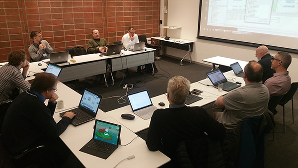

## Cleaning the data

Since we used day one of the hackfest to get a better understanding of the data, we were ready to move on to the preprocessing stage of the hackfest. This stage turned out to be the most time-consuming stage of the whole hackfest (which is to be expected when working with data). There are multiple ways of how you can clean the data. We already knew that we were going to use the designer in AML Studio for the making of the machine learning model, and we also wanted to leverage more aspects of the package (like the Jupyter notebooks which works as an integrated part of AML Studio). If we could split the work where we did some of the preprocessing in AML Studio but mostly in the Jupyter Notebook to learn and expand our knowledge; that would be the most optimal strategy for our application (mixing both worlds). We decided to go for that approach and learn Python with the use of the Pandas framework for preprocessing of the data. 

Pandas is an open source, BSD-licensed library providing high-performance, easy-to-use data structures and data analysis tools for the Python programming language. Since Jupyter notebooks is an integrated part of the AML Studio, there were no issues in creating a Jupyter IPython Notebook and performing the cleaning tasks within this notebook. We loaded the dataset from the Azure Storage Blob, did all our data cleaning and saved the file back into Azure Storage Blob. Jupyter notebooks with pandas proved to be extremely valuable and really helpful for us as it was versatile and consisted of all the functions we needed to perform our tasks. This is definitely something we will continue on using and encourage others to use as well for their own cleaning tasks in their respective projects.

We have created a public repository with three Jupyter IPython Notebooks that consists of documented python code which [shows the true usefulness of the pandas framework](https://github.com/readyforchaos/Pandas-transform).
(note: I have deleted the storage account name and key. You need to insert your own account name and key in order to connect to your storage blob in Azure). 

We started off with more than 300 columns (features) but eventually ended up with “only” 22 features and 60 882 observations of data (rows) after the cleaning. We decided to drop a lot of features so that it wouldn’t clutter the algorithm and to make sure it focused on the important features rather than obsolete ones that don't have any predictive power (based on intuition and the domain knowledge of the people at DNV GL).

An example of how we leveraged the pandas data frame structure to calculate the mean for a data frame column without including data that consisted of -999 or were NULL.

```python
mean_wallthickness = df[(df.WALLTHICKNESS != -999) & (df.WALLTHICKNESS).notnull()].WALLTHICKNESS.mean()
```
We then used this variable to replace all -999 and NULL occurrences with the mean wall thickness that was calculated above.

```python
df['WALLTHICKNESS'] = df['WALLTHICKNESS'].replace(['-999'], mean_wallthickness)
df['WALLTHICKNESS'] = df['WALLTHICKNESS'].fillna(mean_wallthickness)
```

It was also very easy for us to execute commands on the fly and visualize our data without having to open tools like Power BI to gain insight and better understanding what we were working with.
Below, we are using the matplot library for python to create a simple histogram of the distribution of the corrosion depth as well as showing the frequency per depth.

```python
import matplotlib.pyplot as plt
data = df['DEPTH']
df['DEPTH'].plot.hist()
plt.show()
```

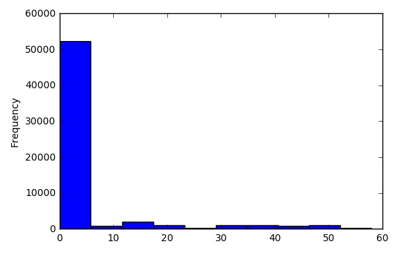

After we were done with cleaning the data, we saved the file back onto the storage blob as a csv-file so that we could grab that in AML Studio.

```python
df.to_csv(output_filename, index=False)
block_blob_service.create_blob_from_path(
    container_name,
    output_filename,
    output_filename,
    content_settings=ContentSettings(content_type='text/csv')
    )
```

We did not only use Jupyter IPython Notebooks for the data cleaning, we also decided to do some simple preprocessing in Azure ML Studio like editing the metadata for the columns (casting the columns to the appropriate datatypes), selecting specific features to include/exclude, replaced some missing values and cleared some features for being treated as predictive features by mentioning them as fields. This is how the whole process ended up looking:

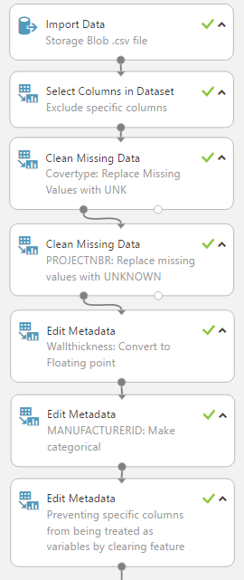

## Building the model

When building the model in AML Studio, we decided to split the data into two pieces. A simple way to use one dataset to both train and estimate the performance of the algorithm on unseen data is to split the dataset. You take the dataset, and split it into a training dataset and a test dataset. In our case, 70% of the data went for the training of the model, and 30% of the data went for testing. This split might vary based on the size of the dataset. The important aspect of the splitting, is to have enough data to train the model properly and to test the model properly, which is indeed the main purpose of the splitting. We also checked “randomize split” so the extraction would be random and not from top to bottom. We did not give the split module a seed. If we wanted to repeat the results of a split operation (rectify model variance), we could specify the seed for the random number generator. Otherwise the random seed is set by default to 0. This ensures that the system clock will set the initial seed, and should result in slightly different results each time we perform the split.

We then dragged multiple “train” modules into the canvas as well as multiple score and permutation feature importance modules. The permutation feature importance module computes a set of feature importance scores for the data we provide. It does slight variations and looks at how the model performed based on those changes to see where the impact lies. This gives a good indicator to which features has predictive power. The filter-based feature selection module does much of the same calculations but allows you to specify which feature scoring method you would like to use. The different algorithms it supports are:

* Pearson Correlation
* Mutual Information
* Kendall Correlation
* Spearman Correlation
* Chi Squared
* Fisher Score
* Count Based

We dragged one module with each of the different algorithms to see how they varied from each other.

Some interesting insights we made based on the permutation feature importance module, were the following (ranked descending order):

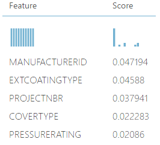

It shows us that specific manufacturers of the pipes might be exposed to corrosion rather more than others. External coating type also seems to have a correlation to corrosion and some projects might have sloppy work done to them based on the score of the feature importance. This must obviously be taken with a grain of salt as less data means large certainty bound and might be the subject to overfitting, but is interesting to think about.

For the training module, we decided that the column we wanted to predict, was “depth” as this measure implies if there is corrosion or not. We binned the amount of corrosion into categorical values of 0, 1 and 2.

If the amount of corrosion was between 0 and 1 percentage, we set the value to 0 (no corrosion). If the value was between 1 and 40 percentage, we set the value to 1 (some corrosion). If the value was between 40 and 100 percent, we set the value to 2 (severe corrosion).

This allowed us to easily operate with the predictive column as classes. We wrote the following python code in Jupyter IPython notebook to perform the binning:

```python
bins = [-1, 1, 40, 100]
df['DEPTH'] = pd.cut(df['DEPTH'], bins, labels = [0, 1, 2])
```

We proceeded to the decision step of which algorithms to use for our problem. Since we had binned the possible outputs into classes, it was natural for us to proceed with the algorithms inside the multiclass classification umbrella. We used the [Azure Machine Learning Cheat Sheet](https://docs.microsoft.com/en-us/azure/machine-learning/machine-learning-algorithm-cheat-sheet) to get a better overview of all the algorithms.

The available multi-class classification algorithms in AML Studio:

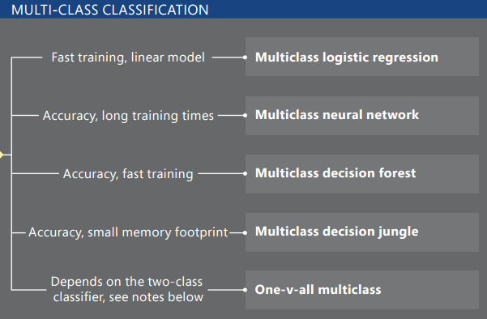

We dragged all of the algorithms into the canvas to see which one actually performed the best. 
This is how the respective flow of the experiment looked like:

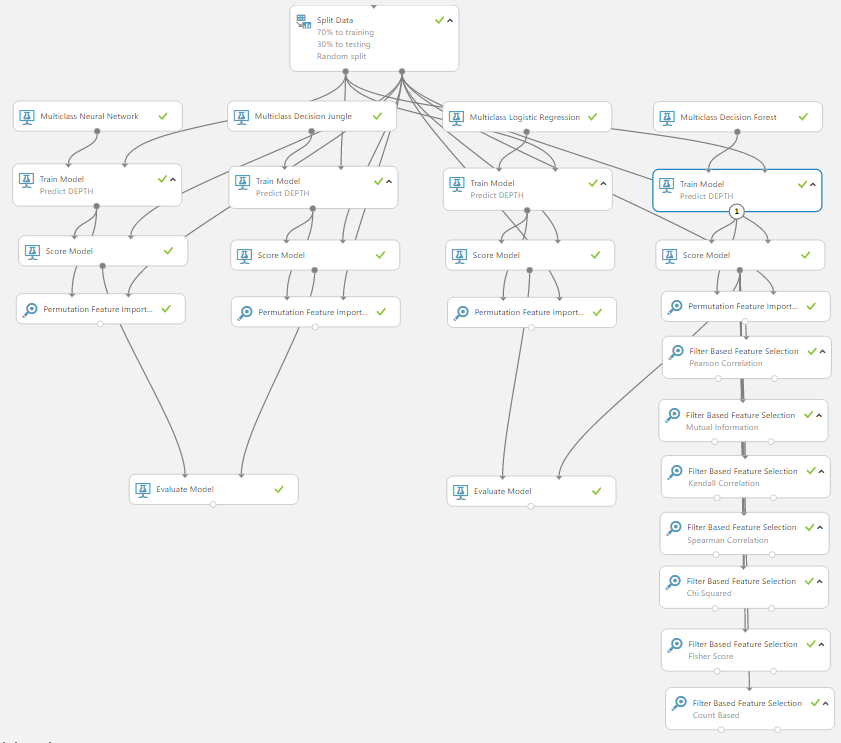

(note: the filter-based feature selection modules are just connected to the score of the multiclass decision forest algorithm since it performed the best during the first run).

## Evaluating the model

Evaluating the performance of a model is one of the core stages in the data science process. It indicates how successful the scoring (predictions) of a dataset has been by a trained model. We decided to use the evaluate model module for evaluating the results of the classifiers. We dragged both the outputs of two of the scores into the evaluate module to easily assess how they performed by visualizing the results.

I recommend reading [this article on how to evaluate your machine learning model in Azure.](https://docs.microsoft.com/en-us/azure/machine-learning/machine-learning-evaluate-model-performance)

We mostly followed the same procedures and decided to stick to the confusion matrix as well as the overall accuracy when deciding which algorithm to go with. The evaluate module outputs a confusion matrix showing the number of true positives, false negatives, false positives, and true negatives, as well as ROC, Precision/Recall, and Lift curves for binary classification. This is how our confusion matrix looked like for the first two algorithms (left: Multi-class neural network, right: Multi-class decision jungle).

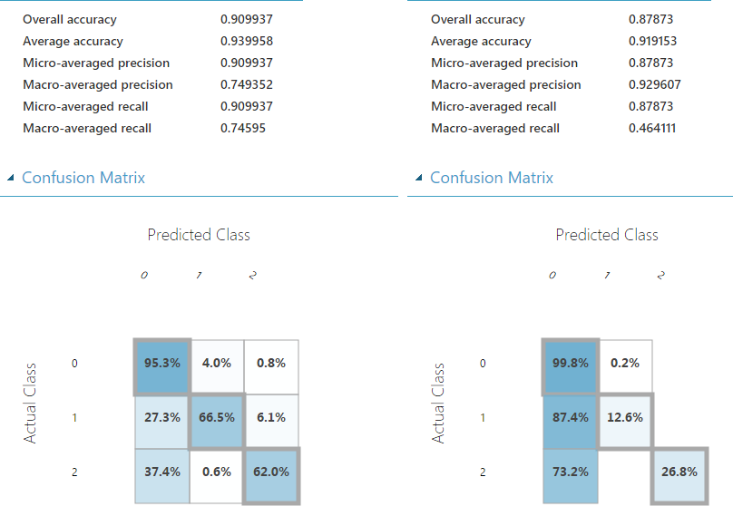

You can see that the neural network performed well with an overall accuracy of 90.0% versus 87.7% for the multi-class decision jungle. You can easily see the trend where it shows that it predicted 95.3% correct when there was no corrosion, 66.5% correct when there was some corrosion and 62% correct when there were severe signs of corrosion. By hovering the mouse cursor over a specific cell, you can see the frequency of the predictions.

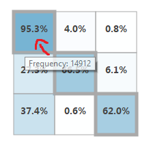

For the other two algorithms, this is how they respectively ended up (left: multi-class logistic regression, right: multi-class decision forest).

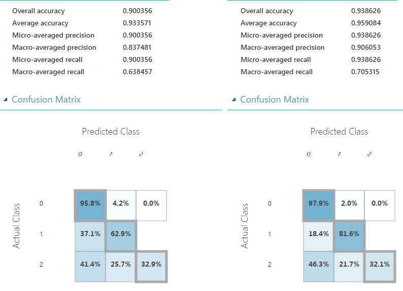

By assessing the results of the confusion matrix, you can see that the overall accuracy of the multi-class decision forest was slightly better than any other algorithm we tested. Although the overall accuracy was better, we decided to stick with the neural network algorithm since it's generally a better performing algorithm once DNV GL starts to get more and more data into the mix. We were also more satisfied with the outcome of the confusion matrix on the class 2 predictions of the neural network.

Running the model on a 70% (training) and 30% (testing) split with a dataset from Azure Storage blob CSV-file consisting of 60 000 rows (observations) took merely 3 minutes. This included some of the preprocessing stages that were done in the Azure ML Studio itself.

## Optimizing the model

Generally, when working with a neural network algorithm, you have more possibilities of playing around with the parameters of the network. There are no exceptions for this in Azure ML Studio either. By standard, the number of hidden nodes were set to 100 and number of learning iterations were also set to 100. We went for the fully-connected case for the hidden layer specification, which is defined as follows:

* The neural network model has one hidden layer.
* The output layer is fully connected to the hidden layer, and the hidden layer is fully connected to the input layer.
* The number of nodes in the input layer is determined by the number of features in the training data.
* The number of nodes in the hidden layer is determined by the user (with a default value of 100).
* The number of nodes in the output layer depends on the number of classes.

There are also possibilities for extending the optimization stage even further by leveraging the [NET# neural networks specifications language](https://docs.microsoft.com/en-us/azure/machine-learning/machine-learning-azure-ml-netsharp-reference-guide) to create custom definition scripts. Since the number of true positives in the dataset was so few (3000 observations out of 60 000 possible), the certainty bound is going to be very wide with less data. We did not want to overfit the model either, so since the standard parameters gave us good enough results, we decided to not write any custom Net# script for this project. 

## Creating a web service

Creating a web service from the machine learning model is trivial when you feel you have gotten a well enough performing model. You can create and expose JSON through a machine learning web service with the click of a button.

This is how our predictive experiment ended up looking:

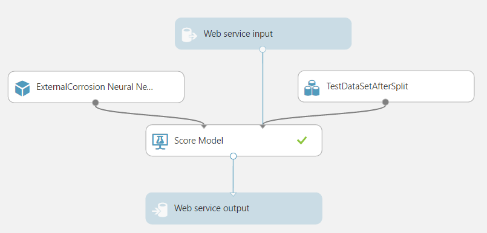

There was no need to have the web service input located at the top of the pipeline as no data cleaning is needed when the model already has been created, so we decoupled the input and connected it directly into the score model module with the resulting output on the other end.

If we right-click and visualize the scoring model, we can see that 30% (18265 rows) of the dataset has been used for testing purposes.

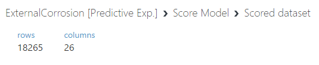

## Integrating the model

At this stage, we handed the web service over to DNV GL who had the task of integrating the predictions into their Synergi Pipeline software. This is the diagram of the machine learning structure:

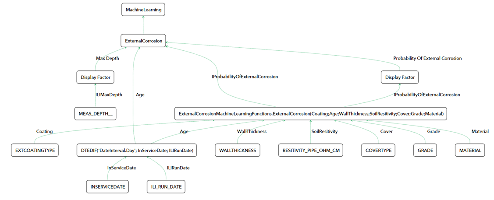

IProbabilityOfExternalCorrosion is what makes the predictions and sends the response back to the Synergi Pipeline software for visualization based on the request.

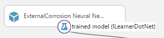

## Solution

The final output results in visualization on top of a map visual in the Synergi Pipeline software.

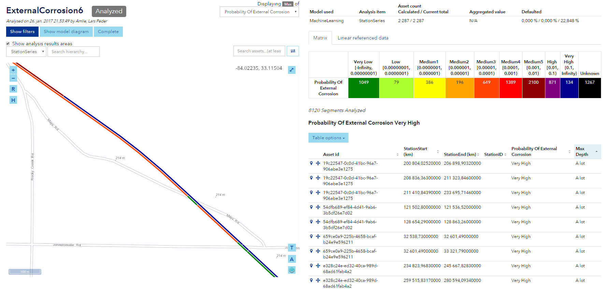

The matrix on the right side tells us the probability of external corrosion on pipelines and the frequency.

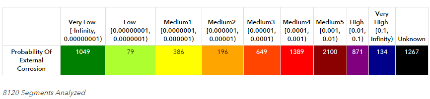

There are some sections on the map that show the variation from very low levels of corrosion over to very high levels of corrosion. This insight can help DNV GL to more accurately assess pipelines without having to dig each pipe up from the ground and assess the integrity of the pipe. Based on rational observations, the decision can be made whether to perform a direct assessment of the pipe or not. This has the potential to lower costs and potentially prevent disasters for happening. This scenario is called predictive maintenance. It is worth mentioning that the machine learning model is biased towards giving more true negative than false positives. This is because you would rather have a higher rate of assessments that turned out to be negative than lower rates of assessments that turned out to be positive where there potentially is more which we are not seeing). This phenomenon is called precision and recall. Precision (also called positive predictive value) is the fraction of retrieved instances that are relevant, while recall (also known as sensitivity) is the fraction of relevant instances that are retrieved.


Picture from the Wikipedia user [Walber.](https://commons.wikimedia.org/wiki/User:Walber)

Read more about precision and recall at [Wikipedia.](https://en.wikipedia.org/wiki/Precision_and_recall)

## Architecture

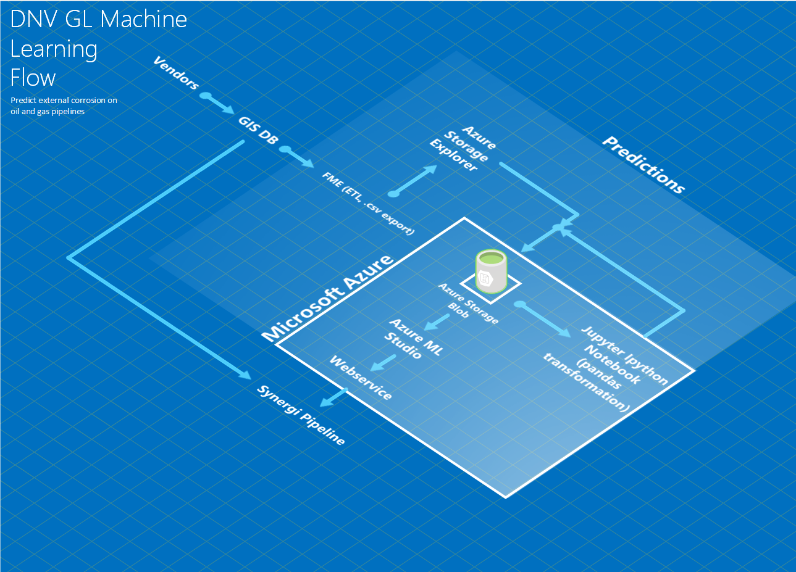

## Conclusion
### General lessons

We learned that the pandas framework is extremely useful when it comes to looking at the data from different angles, trying to gain insight and to transform the data based on a pre-developed scrubbing strategy. The power of the framework really showed its true colors and amazed each and every one on the team. The Jupyter IPython notebooks are something that we will continue to use when working with multiple people on a project and where there is data cleaning involved. It allowed us to easily share and collaborate on code with the capabilities of using whatever language or framework we wanted to. The notebooks support everything from F#, R, the Cognitive Toolkit (CNTK), as well as many other popular frameworks and samples already pre-populated in the gallery. We also managed to gain some valuable insight about the domain itself and how the different features within the data set correlate with corrosion.

### Opportunities going forward

DNV GL is eager to leverage the power of machine learning and is already planning to incorporate this method into other applications in their ecosystem. More data needs to be collected through customer collaboration and DNV GL will iterate on the current solution definition based on collaboration feedback. DNV GL would also like to build and expand the ML knowledge as it relates to using it for other integrity aspects, as well as publish work and results to industry conferences and publications based on top of a go to market plan.
All in all, DNV GL and Microsoft are very happy with the collaboration and we are proud of the results we managed to come up with in such a short amount of time.

A big thank you to everyone involved.

### Resources

Read about DNV GL [Wikipedia](https://en.wikipedia.org/wiki/DNV_GL)

Read about Pandas framework [Pandas](http://pandas.pydata.org/)

Look at the [code snippets used for this project](https://github.com/readyforchaos/Pandas-transform)

Look at the [Azure Machine Learning Cheat Sheet](https://docs.microsoft.com/en-us/azure/machine-learning/machine-learning-algorithm-cheat-sheet)

Create your own [Jupyter IPython Notebook](https://notebooks.azure.com/)

Learn [how to evaluate your machine learning model in Azure](https://docs.microsoft.com/en-us/azure/machine-learning/machine-learning-evaluate-model-performance)

Read about the [NET# neural networks specifications language](https://docs.microsoft.com/en-us/azure/machine-learning/machine-learning-azure-ml-netsharp-reference-guide)

Read more about [Precision and Recall at Wikipedia](https://en.wikipedia.org/wiki/Precision_and_recall)

Read about [sensitivity and specificity](https://en.wikipedia.org/wiki/Sensitivity_and_specificity)